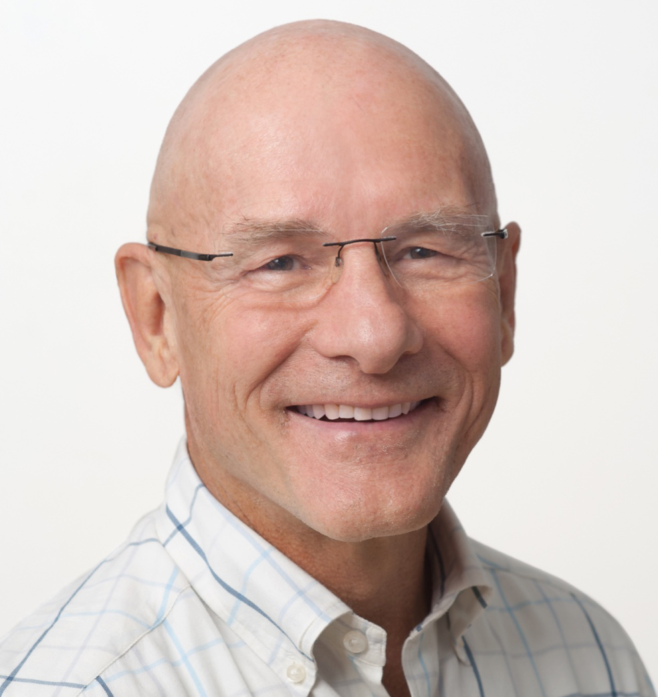
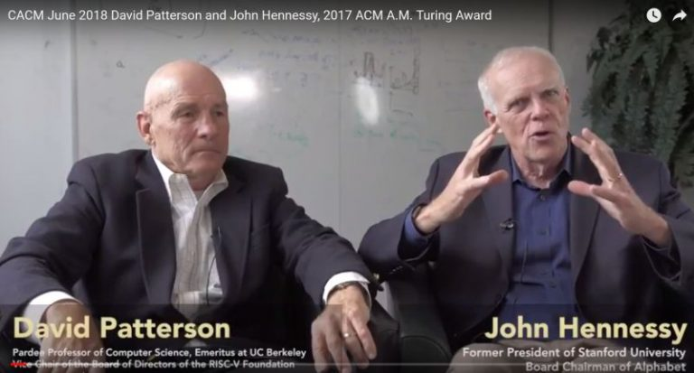

# David Patterson

 
 

 ##### Indice
- [1.Introduzione](#introduzione)
- [2. Biografia](#biografia)
   - [2.1 Giovinezza e Istruzione](#giovinezza-e-istruzione)
   - [2.2 Pubblicazioni](#pubblicazioni)
- [3. Attivita'](#attivita)
   - [3.1 Ricerca e Carriera](#ricerca-e-carriera)
   - [3.2 Riconoscimenti e Turing Award](#riconoscimenti-e-turing-award)
   - [3.3 Attivita' correnti](#attività-correnti)
- [4. Aforismi](#aforismi)
- [5. Presentazione di John Hennessy e David Patterson Conferenza del Premio Turing(2017)](#presentazione-di-john-hennessy-e-david-patterson-conferenza-del-premio-turing-2017)

------
## INTRODUZIONE

David Andrew Patterson (Evergreen Park, 16 novembre 1947) è un informatico statunitense.
È uno dei pionieri dell'architettura RISC e della tecnologia RAID. È coautore di cinque libri, inclusi due con John L. Hennessy, molto utilizzati nello studio dell'informatica.
| informazioni      |  |
| :---        |    :----:  |
| Nome e cognome    | David Patterson|
| Data di nascita   |  16 Novembre 1930        |
| Luogo di nascita  |Evergreen Park        |
| Data di morte     | Assente |
|luogo di morte     | assente|
 
-------
## BIOGRAFIA
------

### GIOVINEZZA E ISTRUZIONE

 Nato a Evergreen, Illinois nel 1947, David A. Patterson si è diplomato alla South High School di Torrance, California, e poi si è iscritto all'Università della California, Los Angeles (UCLA). La prima persona della sua famiglia a laurearsi al college, Patterson ha conseguito la laurea nel 1969 e la laurea magistrale 1970 in informatica.  Patterson è stato successivamente assunto presso l'Università della California come componente del dipartimento di informatica / ingegneria elettrica di Berkeley. Il dottorato di Patterson è stato consigliato da David F e la sua tesi riguardava i metodi scrivibili di control store per i sistemi operativi, quindi iniziò la sua carriera a Berkeley con Carlo Sequin lavorando al progetto X-TREE guidato da Alvin Despain. Patterson si prese un anno sabbatico di tre mesi alla Digital Equipment Corporation (1979), dove Joel Emer e Douglas Clark stavano iniziando le misurazioni su un minicomputer VAX. Aveva un set di istruzioni molto complesso e quindi un microprogramma molto ampio e complesso.

-----
 
 ### PUBBLICAZIONI
 

Patterson e Hennessy nel 1990 hanno codificato le loro intuizioni condivise in un libro molto influente, Computer Architecture: A Quantitative Approach. Questo libro, giunto alla sua sesta edizione, ha fornito un quadro semplice, robusto e quantitativo per la valutazione dei sistemi integrati. Sun ha adottato l'architettura di Berkeley, mentre Silicon Graphics ha acquistato il MIPS di Hennessy.

- “Struttura, organizzazione e progetto dei calcolatori.Interdipendenza tra hardware e software” edizione 2000 ,Editore jackson Libri;

- “Struttura e progetto dei calcolatori” edizione 2010, Editore Zanichelli ;

- “Struttura e progetto dei calcolatori” edizione 2014, Editore zanichelli;

- “Stuttura e progetto dei calcolatori.Progettare con RISC-V” Edizione 2019, Editore Zanichelli;

- “Architettura dei computer.Un approccio quantitativo” edizione 2023,Editore Jackson Libri;

------
## ATTIVITA'

-----
### RICERCA E CARRIERA

Patterson ha lavorato sulla riduzione degli errori di microcodifica.Tornati a Berkeley, Patterson e Sequin(riconosciuto come uno dei pionieri nella progettazione di processori) hanno collaborato a una serie di quattro corsi in cui hanno incaricato gli studenti laureati di indagare su queste idee. Patterson ha coniato l'acronimo RISC (Reduced Instruction Set Computer) per descrivere un chip risultante, noto come RISC-1, con 44.420 transistor. Un buon computer per il lavoro sui sistemi operativi UNIX e sulle tecniche di programmazione C, poteva gestire grandi quantità di memoria e utilizzava tecniche di pipelining per gestire più istruzioni contemporaneamente. Immediatamente popolari, i corsi hanno portato a un Distinguished Teaching Award (1982). Dal 1982 al 1983, Sequin guidò il progetto del chip RISC-II; Patterson ha gestito la collaborazione tra UC Berkeley e il programma ARPA VLSI. Questo chip da 40.760 transistor, tre volte più veloce e grande la metà del RISC-1, è diventato la base altamente influente della microarchitettura SPARC di Sun Microsystems. Patterson ha incontrato per la prima volta John Hennessy a una riunione per i progetti VLSI di ricerca finanziati dalla DARPA nel 1980 o 1981, dove ognuno presentava le proprie idee. RISC-2 è emerso contemporaneamente al prototipo MIPS (Microprocessor without Interlocked Pipeline Stages) di Hennessy a Stanford nel 1983. Le discussioni tra i progetti RISC e MIPS furono presto sminuite dalla loro tesi comune contro CISC (Complex Instruction Set Computers), utilizzato dall'intero sistema di computer industriali . Patterson ha resistito risolutamente al richiamo di lasciare l'università per perseguire la tecnologia RISC in un'azienda.  Joel Birnbaum, supervisore di John Cocke all'IBM, portò le idee RISC alla Hewlett-Packard. Una serie di idee RISC micro-codificate chiave sono state incorporate nei chip dei personal computer di Intel, quindi i prodotti mobili (ad esempio iPhone) hanno enfatizzato l'efficienza, il consumo energetico e le dimensioni del die. Nel loro discorso congiunto del Turing Award all'ISCA (2018), Patterson e Hennessy hanno osservato che un incredibile 99% degli oltre 20 miliardi di microprocessori attualmente prodotti ogni anno sono processori RISC e si trovano in quasi tutti gli smartphone, i tablet e i miliardi di dispositivi integrati che costituiscono internet. Tra il 1989 e il 1993, Patterson ha guidato il progetto RAID (Redundant Arrays of Inexpensive Disks) con il collega di Berkeley Randy Katz, migliorando notevolmente la velocità e l'affidabilità dei sistemi di dischi economici. La maggior parte dei server Web ora utilizza una qualche forma di RAID. Successivamente, Patterson ha contribuito all'implementazione di esperimenti di sistemi complessi collegando in rete computer più piccoli, predicendo "architetture multilivello" ora utilizzate da molte società Internet.

----

 ### RICONOSCIMENTI E TURING AWARD

Patterson, nominato ACM Fellow nel 1994, è anche Fellow di AAAS e IEEE. È stato eletto nelle National Academies of Engineering, Sciences e nell'American Academy of Arts and Sciences. Hennessy e Patterson hanno vinto numerosi premi congiunti, tra cui la John von Neumann Medal (IEEE, 2000), il premio Eckert-Mauchly ACM/IEEE nel 2001; Fellows per il Computer History Museum nel 2007 e l'ACM Turing Award nel 2017,riconoscenza dovuta a Patterson per essere stato uno dei padri fondatori della moderna scienza informatica.

----
### ATTIVITÀ CORRENTI

Patterson oggi è Distinguished Engineer presso Google e ricopre il ruolo di vicepresidente del consiglio di amministrazione della RISC-V Foundation Insegna architettura dei calcolatori presso la università della California, Berkeley. Attualmente i suoi interessi di ricerca sono rivolti al progetto di innovativi microprocessori basati sull'utilizzo di DRAM intelligenti.

-----

## AFORISMI
------
>  "Troppo ambizioso, senza risorse, molto divertente";

> “Se facilmente prodotto, allora gli errori saranno ridotti";

>"Quando mi sono laureato alla UCLA, sono andato in giro a intervistare in molti posti…..
Hanno davvero detto: ".... L'insegnamento è qualcosa che non ci interessa: la moneta del regno è la pubblicazione...'. Ero disturbato (perché) ciò significava che avrei trascorso molte ore della mia vita di fronte a un gruppo di studenti, e se non avessi fatto un buon lavoro, avrei deluso molti studenti. Se facessi un buon lavoro, deluderei le persone per cui ho lavorato. Ma quando sono arrivato a Berkeley, è stato fantastico. Il dipartimento di ingegneria elettrica / informatica ha sottolineato che si preoccupavano davvero dell'insegnamento, ...";

> "Non è quanti progetti inizi, è quanti finisci ... Quindi, scegli una cosa importante all'anno e finiscila";

-----
## PRESENTAZIONE DI JOHN HENNESSY E DAVID PATTERSON CONFERENZA DEL PREMIO TURING (2017)

 
 

https://youtu.be/3LVeEjsn8Ts

----