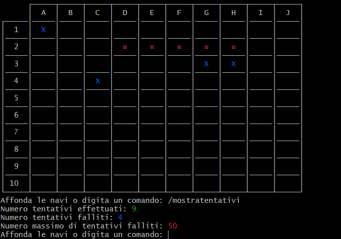

# Report

## Indice
- [1. Introduzione]( #1-introduzione)
- [2. Modello di dominio](#2-il-modello-di-dominio)
- [3. Requisiti specifici](#3-requisiti-specifici)
    - [3.1 Requisiti funzionali](#31-requisiti-funzionali)
    - [3.2 Requisiti non funzionali](#32-requisiti-non-funzionali)
- [4. System Design](#4-system-Design)
- [5. OO Design](#5-oo-design)
   - [5.1 Diagramma delle classi](#51-diagramma-delle-classi)
   - [5.2 Diagrammi di sequenza](#52-diagrammi-di-sequenza)
   - [5.3 Commentare le decisioni prese](#53-commentare-le-decisioni-prese)
- [6. Riepilogo del test](#6-riepilogo-del-test)    
- [7. Manuale utente](#7-manuale-utente)
- [8. Processo di sviluppo e organizzazione del lavoro](#8-processo-di-sviluppo-e-organizzazione-del-lavoro) 
- [9. Analisi retrospettiva](#9-analisi-retrospettiva)
    - [9.1 Sprint 0](#91-sprint-0)
    - [9.2 Sprint 1](#92-sprint-1)

## **1. Introduzione**
__________
Battaglia Navale è un gioco in cui l'obiettivo è affondare tutte le navi presenti sulla griglia, senza superare un numero massimo di tentativi falliti o il tempo a disposizione. Ad ogni tentativo, il giocatore sceglierà una cella della griglia (fornendo relativa cordinata numerica per la riga e cordinata alfabetica per la colonna). Il tentativo potrà risultare fruttuoso (colpendo una nave) oppure fallimentare (finendo in acqua). Quando una nave viene colpita su tutte le celle, sulle quali essa è disposta, risulterà affondata.

L'applicativo è una versione semplificata che rispetta specifici requisiti funzionali.

## **2. Il modello di dominio**
__________

## **3. Requisiti specifici**
_________

 ### **3.1 Requisiti funzionali**

- **RF1**: come giocatore voglio mostrare l'help con elenco comandi.

      Al comando /help o invocando l'app con flag --help o -h,l'applicazione presenterà, come risultato, una descrizione concisa, che normalmente appare all'avvio del programma, seguita dalla lista di comandi disponibili, uno per riga, come da esempio:
      •	gioca
      •	esci
      •	...

- **RF2**: come giocatore voglio chiudere il gioco.
     
      Al comando /esci, l'applicazione chiede conferma .
      •	Se la conferma è positiva, l'applicazione si chiude restituendo il controllo al sistema operativo.

      •	Se la conferma è negativa, l'applicazione si predispone a ricevere nuovi tentativi o comandi.

- **RF3**: come giocatore voglio impostare il livello di gioco per variare il numero massimo di tentativi sbagliati.

      Criteri di accettazione

      Al comando /facile 
      l’applicazione risponde con OK e imposta a 50 il numero massimo di tentativi falliti

      Al comando /medio 
      l’applicazione risponde con OK e imposta a 30 il numero massimo di tentativi falliti

      Al comando /difficile 
      l’applicazione risponde con OK e imposta a 10 il numero massimo di tentativi falliti

      ESTENSIONI:

      1) Se il giocatore gioca con una griglia LARGE:
            • /facile imposta a 250 il numero massimo di tentativi falliti
            • /medio imposta a 150 il numero massimo di tentativi falliti
            • /difficile imposta a 50 il numero massimo di tentativi falliti
      2) Se il giocatore gioca con una griglia EXTRALARGE:
            • /facile imposta a 525 il numero massimo di tentativi falliti
            • /medio imposta a 300 il numero massimo di tentativi falliti
            • /difficile imposta a 100 il numero massimo di tentativi falliti
      
      Per la griglia standard vale il numero di default massimo di tentativi falliti.

- **RF4**: come giocatore voglio mostrare il livello di gioco e il numero di massimo di tentativi falliti

      Al comando /mostralivello, l’applicazione risponde visualizzando il livello di gioco e il numero di massimo di tentativi falliti

- **RF5**: come giocatore voglio mostrare i tipi di nave e il numero 
    
    
      Al comando /mostranavi 
      l’applicazione risponde visualizzando, per ogni tipo di nave, la dimensione in quadrati e il numero di esemplari da affondare:
      -	Cacciatorpediniere            ⊠⊠                esemplari: 4
      -	Incrociatore                  ⊠⊠⊠               esemplari: 3 
      -	Corazzata                     ⊠⊠⊠⊠              esemplari: 2 
      -	Portaerei                     ⊠⊠⊠⊠⊠             esemplari: 1 

- **RF6**: come giocatore voglio iniziare una nuova partita

      Al comando /gioca :

      se nessuna partita è in corso l'applicazione imposta causalmente le navi, in orizzontale o in verticale, mostra la griglia vuota e si predispone a ricevere il primo tentativo o altri comandi.

- **RF7**: come giocatore voglio svelare la griglia con le navi posizionate

      Al comando /svelagriglia 
      l’applicazione risponde visualizzando la  griglia di gioco  e tutte le navi posizionate.

- **RF8**: Come giocatore voglio impostare il numero massimo di tentativi falliti per livello di gioco

      Al comando /facile numero
      l’applicazione risponde con OK e imposta a numero il numero massimo di tentativi falliti

      Al comando /medio numero
      l’applicazione risponde con OK e imposta a numero il numero massimo di tentativi falliti

      Al comando /difficile numero
      l’applicazione risponde con OK e imposta a numero il numero massimo di tentativi falliti

      ESTENSIONI:
      
      1) Se il giocatore gioca con una griglia STANDARD, l'utente può impostare un numero massimo di tentativi fallibili in un range che varia tra le diverse difficoltà:
            • /facile -> range di modifica da 50 a 70
            • /medio -> range di modifica da 30 a 49
            • /difficile -> range di modifica da 1 a 29
      
      2) Se il giocatore gioca con una griglia LARGE, l'utente può impostare un numero massimo di tentativi fallibili in un range che varia tra le diverse difficoltà:
            • /facile -> range di modifica da 200 a 294
            • /medio -> range di modifica da 100 a 199
            • /difficile -> range di modifica da 1 a 99
      
      3) Se il giocatore gioca con una griglia EXTRALARGE, l'utente può impostare un numero massimo di tentativi fallibili in un range che varia tra le diverse difficoltà:
            • /facile -> range di modifica dca 400 a 646
            • /medio -> range di modifica da 200 a 399
            • /difficile -> range di modifica da 1 a 199

- **RF9**: Come giocatore voglio impostare direttamente il numero massimo di tentativi che si possono fallire

      Al comando /tentativi numero
      l’applicazione risponde con OK e imposta a numero il numero massimo di tentativi falliti

- **RF10**: come giocatore voglio impostare la taglia della griglia

      Al comando /standard
      l’applicazione risponde con OK e imposta a 10x10 la dimensione della griglia (è il default)
      
      Al comando /large
      l’applicazione risponde con OK e imposta a 18x18 la dimensione della griglia

      Al comando /extralarge
      l’applicazione risponde con OK e imposta a 26x26 la dimensione della griglia

      ESTENSIONI:

      1) La difficoltà di default viene impostata a facile con il numero massimo di tentativi fallibili associati alla griglia.

      

- **RF11**: come giocatore voglio impostare il tempo di gioco

      Al comando /tempo numero
      l’applicazione risponde con OK e imposta a numero il numero minuti a disposizione per giocare

      ESTENSIONI:

      1) E' stato impostato un tempo di default pari a 15 minuti.

- **RF12**: come giocatore voglio mostrare il tempo di gioco

      Al comando /mostratempo
      l’applicazione risponde visualizzando il numero di minuti trascorsi nel gioco e il numero di minuti ancora disponibili

      ESTENSIONI:

      1) L'utente oltre a visualizzare il tempo trascorso e tempo disponibile in minuti visualizzerà i secondi.
     
- **RF13**: come giocatore voglio effettuare un tentativo per colpire una nave

      Digitando una coppia di caratteri separati da un trattino, corrispondenti rispettivamente al numero di riga e alla lettera della colonna, (es. B-4), l’applicazione risponde:

      • “acqua” se sulla cella non è posizionata nessuna nave;
      • "colpito" se sulla cella è posizionata una nave;
      • "colpito e affondato" se sulla cella è posizionata una nave ed è l’ultima cella non colpita della nave.
      Qualunque sia l’esito del tentativo, l’applicazione mostra la griglia con le navi colpite parzialmente o affondate, il numero di tentativi già effettuati, e il tempo trascorso.
      La partita termina con successo se il tentativo ha affondato l’ultima nave.
      La partita termina con insuccesso se è stato raggiunto il numero massimo di tentativi falliti o se è scaduto il tempo di gioco.

- **RF14**: come giocatore voglio mostrare la griglia con le navi colpite e affondate

      Al comando /mostragriglia

      l’applicazione risponde visualizzando, una griglia con le righe numerate a partire da 1 e le colonne numerate a partire da A, con le navi affondate e le sole parti già colpite delle navi non affondate.

- **RF15**: come giocatore voglio mostrare il numero di tentativi già effettuati e il numero di tentativi falliti

      Al comando /mostratentativi

      l’applicazione risponde visualizzando il numero di tentativi già effettuati, il numero di tentativi falliti e il numero massimo di tentativi falliti

- **RF16**: come giocatore voglio abbandonare una partita

      Al comando /abbandona

      l'applicazione chiede conferma

      • se la conferma è positiva, l’applicazione risponde visualizzando sulla griglia la posizione di tutte le navi e si predispone a ricevere nuovi comandi
      • se la conferma è negativa, l'applicazione si predispone a ricevere nuovi tentativi o comandi

 ### **3.2 Requisiti non funzionali**

- **RNF1**: il container docker dell’app deve essere eseguito da terminali che supportano Unicode con encoding UTF-8 o UTF-16

      Elenco di terminali supportati
      
      Linux:
      - terminal

      Windows:
      - Powershell
      - Git Bash (in questo caso il comando Docker ha come prefisso winpty; es: winpty docker -it ....)

      Comando per l’esecuzione del container
      
      Dopo aver eseguito il comando docker pull copiandolo da GitHub Packages, Il comando Docker da usare per eseguire il container contenente l’applicazione è:

      docker run --rm -it ghcr.io/softeng2223-inf-uniba/battleship-base2223:latest
      
      dove base2223 sarà sostitituito con il nome del gruppo.

## **4. System Design**
__________

Il *System Design* viene principalmente adottato nella progettazione di software di alto livello e consiste nell'identificazione dei principali componenti e delle relazioni tra questi.  
Solitamente, l'architettura di un software deve essere definita nella prima fase di progettazione (inizio fase Sprint 1), ma il nostro Team non ha ritenuto importante applicare uno stile architetturale ben preciso. 

Di conseguenza non c'è stato alcun modo di rappresentarlo e difatto non è stato necessario realizzare nessun diagramma a tale scopo.
Nonostante l'assenza di tutto ciò, si è comunque seguito lo stile di un sistema software robusto e di facile comprensione.  
Infine, si è cercato di rispettare i 4 principi sui cambiamenti ideali, applicando appieno il **principio di Information Hiding**.

## **5. OO Design**
__________
  ### **5.1 Diagramma delle classi**

  1) **DIAGRAMMA DEL COMANDO DIFFICOLTA' PREDEFINITA**
  
  Viene riportato il diagramma che rappresenta le classi coinvolte per il comando `/facile`, tale diagramma è adattabile anche per i comandi `/medio`, `/difficile`.

  

  2) **DIAGRAMMA DEL COMANDO TEMPO NUMERO**
  
  Viene riportato il diagramma che rappresenta le classi coinvolte per il comando `/temponumero`.
  
  

  3) **DIAGRAMMA DEL COMANDO ESCI**
  
  Viene riportato il diagramma che rappresenta le classi coinvolte per il comando `/esci`.
  
  

  4) **DIAGRAMMA DEL COMANDO ABBANDONA**
  
  Viene riportato il diagramma che rappresenta le classi coinvolte per il comando `/abbandona`.
  
  

5) **DIAGRAMMA DEL COMANDO GIOCA**

Viene riportato il diagramma che rappresenta le classi coinvolte per il comando `/gioca`.

6) **DIAGRAMMA DEL COMANDO EFFETTUA TENTATIVO**

Viene riportato il diagramma che rappresenta le classi coinvolte per effettuare un tentativo.

  ### **5.2 Diagrammi di sequenza**

  1)  **DIAGRAMMA DEL COMANDO DIFFICOLTA' PREDEFINITA**

  Viene riportato il diagramma che rappresenta la sequenza delle classi coinvolte per il comando `/facile`, tale diagramma è adattabile anche per i comandi `/medio`, `/difficile`.

  

  2)  **DIAGRAMMA DEL COMANDO TEMPO NUMERO**

  Viene riportato il diagramma che rappresenta la sequenza delle classi coinvolte per il comando `/temponumero`.

  

  3)  **DIAGRAMMA DEL COMANDO ESCI**

  Viene riportato il diagramma che rappresenta la sequenza delle classi coinvolte per il comando `/esci`.

  

   4)  **DIAGRAMMA DEL COMANDO ABBANDONA**

  Viene riportato il diagramma che rappresenta la sequenza delle classi coinvolte per il comando `/abbandona`.

  

 5)  **DIAGRAMMA DEL COMANDO GIOCA**

  Viene riportato il diagramma che rappresenta la sequenza delle classi coinvolte per il comando `/gioca`.

  

  6)  **DIAGRAMMA DEL COMANDO EFFETTUA TENTATIVO**

  Viene riportato il diagramma che rappresenta la sequenza delle classi coinvolte per effettuare un tentativo.

  

  ### **5.3 Commentare le decisioni prese**

Per quanto riguarda l'UML abbiamo deciso di rappresentare 6 delle user story più importanti quali:

    • Il comando /gioca, perchè rappresenta una delle due dinamiche di base dell'applicazione.

    • Il comando /effettuaTentativo, perchè rappresenza la seconda dinamica di base dell'applicazione.

    • Il comando /abbandona, essenziale per ricominciare una nuova partita e riportare l'utente alla schermata principale.

    • Il comando /esci, perchè rappresenta un modo per terminare l'applicazione nel caso in cui l'utente vuole smettere di giocare.

    • Il comando /tempoNumero, perchè rappresenta un comando utile all'utente per personalizzare l'esperienza del gioco.

    • Il comando /facile, chiamato nei diagrammi come 'DifficoltaPredefinita', perchè è la difficoltà di default dell'utente, tuttavia questo comando rappresenta anche i comandi /medio e /difficile perchè la logica è equivalente.

  
 L'acquisizione dell'input da tastiera è stata affidata alla classe GestioneInput mentre la stampa dei vari messaggi è stata affidata alla classe GestioneStampa. 

 Nella classe Comandi abbiamo deciso di implementare tutte le userStory richieste Product Owner in modo tale di averle disponibili in una singola classe.

 La classe analizzatore si occupa di controllare ed interpretare i comandi scritti in input dall'utente, per favorire una user experience ottimale sono stati adottati dei suggerimenti in caso di comando parzialmente conosciuto.

 Per quanto riguarda la gestione delle navi abbiamo ritenuto opportuno la creazione della classe astratta Nave, in modo tale di avere un modello per altre classi specializzate e fornire funzionalità comuni.

 Per l'implementazione del Timer della partita è stato creato un Thread che effettua un countdown, al termine la partita termina.

 Per garantire la corretta terminazione della partita abbiamo utilizzato il metodo inputGame contenuto in GestioneInput, che acquisisce l'input dell'utente non dalla classe Scanner ma dalla classe BufferReader. Questo è fondamentale in quanto all'inzio dell'implementazione della userStory effettua tentativo anche al termine del Timer la classe Scanner aspettava l'input dell'utente e non si manifestava l'uscita della partita e il ritorno alla schermata principale, andando contro i requisiti funzionali del Product Owner.

 Sono state create classi per l'eccezioni personalizzate e sono le seguenti:

 - TimerException: utilizzata per sollevare l'eccezione allo scadere del tempo.

 - AnalizzatoreException: utilizzata per sollevare l'eccezione in caso di input non validi da parte dell'utente.

Seguendo il modello di dominio abbiamo poi deciso di implementare le seguenti classi:

- Giocatore: utilizzata per contenere la griglia appartenente ai tentativi del giocatore, ed un enumerativo che tiene traccia della posizione del giocatore nel gioco.

- Partita: contiene la griglia della partita con le navi posizionate, e tutto il necessario per iniziare una nuova partita ed effettuare un tentativo.

- Griglia: utilizzata per il modellamento della griglia, che viene utilizzata dalla classe Partita e Giocatore.

- Cella: rappresenta la singola cella appartenente ad una Griglia.

 ## **6. Riepilogo del test**
__________
Durante il processo di testing del nostro programma informatico, ci siamo concentrati principalmente sulla verifica delle funzionalità delle **classi** che costituiscono il sistema. Abbiamo dedicato particolare attenzione alle classi Partita, Comandi e Analizzatore.

Abbiamo fatto in modo di simulare una vasta gamma di situazioni estreme al fine di testare le classi. Questo ci ha consentito di individuare eventuali bug o comportamenti inattesi, garantendo che le classi funzionassero correttamente anche in condizioni critiche.

Uno degli aspetti cruciali che abbiamo testato riguarda la gestione delle **diciture errate**. Abbiamo creato test specifici in cui abbiamo inserito comandi malformati o non corretti per verificare se il sistema fosse in grado di riconoscerli come errori e trattarli in modo appropriato. Ad esempio, abbiamo testato la capacità del sistema di riconoscere e gestire comandi con errori di ortografia o sintassi.

Abbiamo inoltre eseguito test specifici per i **comandi contenenti un parametro numerico** inserito dall'utente. Abbiamo verificato che il sistema gestisse correttamente i formati prestabiliti, sia positivi che negativi. Ci siamo assicurati che il sistema riconoscesse tali situazioni come errori e le gestisse adeguatamente.

Abbiamo testato il sistema di **posizionamento automatico delle navi**, verificando che esse fossero posizionate correttamente sulla griglia di gioco.

Abbiamo anche verificato la corretta risposta da parte del sistema in caso di **game over**, che si verifica quando l'utente raggiunge il numero massimo di tentativi falliti o quando scade il tempo di gioco prestabilito.

Abbiamo eseguito test per verificare la risposta del sistema in caso di **vittoria dell'utente**. 

Infine, abbiamo testato la risposta del sistema quando il giocatore **tenta di affondare le navi**, controllando che la visualizzazione sulla griglia di gioco rifletta correttamente la risposta del sistema, e il **funzionamento alla base del gioco**.

Attraverso questi test approfonditi, abbiamo cercato di garantire che il nostro programma informatico fosse solido, affidabile e in grado di gestire una varietà di situazioni nel miglior modo possibile.

Riportato in seguito il coverage dei test effettuati:

## **7. Manuale utente**
__________
**1.** Il gioco si avvia presentando il titolo, seguito da un invito all'utente di digitare un comando.

**2.** Il comando *'/gioca'* permette di avviare il gioco, presentando la griglia di gioco e la richiesta delle coordinate della prima mossa da parte del giocatore o di un comando.All'invocazione del comando, se non vengono applicate personalizzazioni precedenti, verrà generata una griglia 10x10 e  applicato il livello facile di default.

**3.** Il comando *'/help'* permette al giocatore di ricevere delle informazioni generali riguardanti il gioco, seguite dall' elenco comandi.

E' possibile avviare il gioco attraverso i flag *'-h'* / *'--help'* . Verrà visualizzato quindi il comando

**4.** Il comando *'/esci'* permette all' utente di uscire dal gioco, richiedendo esplicita conferma da parte del giocatore. Nel caso in cui la risposta dell' utente sia affermativa, l'applicazione terminerà.

Nel caso di risposta negativa, l'applicazione notificherà all'utente l'avvenuta interruzione del comando, riportandolo nell'applicazione.

**5.** Il comando *'/facile'*, se la partita non è ancora iniziata, permette all' utente di impostare la difficoltà predefinita per la griglia di gioco, mostrando al giocatore l'effettiva avvenuta dell' operazione.

In caso di invocazione del comando in partita, verrà visualizzato un messaggio di errore.

**6.** Il comando *'/medio'*, se la partita non è ancora iniziata, permette all' utente di impostare la difficoltà  predefinita per la griglia di gioco , mostrando al giocatore l'effettiva avvenuta dell' operazione.

In caso di invocazione del comando in partita, verrà visualizzato un messaggio di errore.

**7.** Il comando *'/difficile'*, se la partita non è ancora iniziata, permette all' utente di impostare la difficoltà   predefinita per la griglia di gioco, mostrando al giocatore l'effettiva avvenuta dell' operazione.

In caso di invocazione del comando in partita, verrà visualizzato un messaggio di errore.

**8.** Il comando *'/mostralivello'* fornisce al giocatore la difficoltà scelta e il numero di tentativi falliti massimi associati.

**9.** Il comando *'/mostranavi'* ,fornisce  al giocatore, per ogni nave, il numero  di esemplari e la loro dimensione in quadrati.Esso può essere invocato sia durante il gioco che nel menù principale.

**10.** Il comando *'/svelagriglia'* se iniziata la partita, fornisce al giocatore la griglia con tutte le navi posizionate dall' applicazione.

In caso di invocazione del comando al di fuori della partita, verrà visualizzato un messaggio di errore.

**11.** Il comando *'/abbandona'* se iniziata la partita, fornisce al giocatore, previo consenso esplicito,la possibilità di uscire dalla partita.In caso di risposta affermativa, mostrerà un messaggio di uscita dalla partita,la griglia con tutte le navi posizionate dal computer e riporterà il gioco al menù principale.

In caso di risposta negativa, il giocatore rimarrà nella partita corrente.

In caso di invocazione del comando al di fuori della partita, verrà visualizzato un messaggio di errore.

**12.** Il comando *'/standard'*,se la partita non è ancora iniziata, fornisce al giocatore, una volta invocato , la possibilità di impostare la dimensione della griglia di dimensioni 10x10,e impostando il livello di default a facile per quella griglia.

In caso di invocazione del comando in partita, verrà visualizzato un messaggio di errore.

**13.** Il comando *'/large'*,se la partita non è ancora iniziata, fornisce al giocatore, una volta invocato , la possibilità di impostare la dimensione della griglia di dimensioni 18x18,e impostando il livello di default a facile per quella griglia.

In caso di invocazione del comando in partita, verrà visualizzato un messaggio di errore.

**14.** Il comando *'/extralarge'*,se la partita non è ancora iniziata, fornisce al giocatore, una volta invocato, la possibilità di impostare la dimensione della griglia di dimensioni 26x26,e impostando il livello di default a facile per quella griglia.

In caso di invocazione del comando in partita, verrà visualizzato un messaggio di errore.

**15** Il comando *'/tempo numero*',se la partita non è ancora iniziata, fornisce al giocatore, una volta invocato,la possibilità di modificare il tempo di gioco entro un limite pari a 60 minuti.

Nel caso in cui venga inserito un  numero maggiore di 60 minuti o minore di 1,il sistema fornirà un messaggio di errore.

In caso di invocazione del comando in partita, verrà visualizzato un messaggio di errore.

**16** Il comando *'/mostratempo*',se la partita è iniziata, fornisce al giocatore, una volta invocato,la possibilità di visualizzare il tempo trascorso e il tempo ancora disponibile per giocare.

In caso di invocazione del comando al di fuori della partita, verrà visualizzato un messaggio di errore.

**17** Il comando *'/mostratentativi'*, se la partita è in corso, fornisce al giocatore,una volta invocato, la possibilità di visualizzare il numero di tentativi effettuati, falliti e il numero massimo di tentativi fallibili impostati per la partita.

In caso di invocazione del comando in partita, verrà visualizzato un messaggio di errore.

**18** Il comando *'/tentativi numero'*, se la partita non è ancora iniziata, fornisce al giocatore la possibilità di impostare direttamente il numero di tentativi della partita, all 'interno dei range prestabiliti per la griglia scelta.

In caso d'inserimento di un numero troppo grande o troppo piccolo, rispetto al range predefinito per la griglia corrente, verrà visualizzato un messaggio di errore.

In caso di invocazione del comando in partita, verrà visualizzato un messaggio di errore.

**19** Il comando *'/mostragriglia'*, se la partita è iniziata, stampa la griglia con le navi colpite e affondate.

In caso di invocazione del comando al di fuori della partita , verrà visualizzato un messaggio di errore. 

**20** Il comando *'/facile numero'*, se la partita non è ancora iniziata, imposta il livello di difficoltà a facile e imposta il numero di tentativi fallibili inseriti,se questi rientrano nel range predefinito per quella difficoltà.

Nel caso in cui il giocatore inserisca un numero di tentativi fallibili che non rientra nel range prestabilito per la griglia selezionata, il sistema mostrerà un messaggio di errore.

In caso di invocazione del comando in partita , verrà visualizzato un messaggio di errore.

**21** Il comando *'/medio numero'*, se la partita non è ancora iniziata, imposta il livello di difficoltà a medio e imposta il numero di tentativi fallibili inseriti,se questi rientrano nel range predefinito per quella difficoltà.

Nel caso in cui il giocatore inserisca un numero di tentativi fallibili che non rientra nel range prestabilito per la griglia selezionata, il sistema mostrerà un messaggio di errore.

In caso di invocazione del comando in partita , verrà visualizzato un messaggio di errore.

**22** Il comando *'/difficile numero'*, se la partita non è ancora iniziata, imposta il livello di difficoltà a medio e imposta il numero di tentativi fallibili inseriti,se questi rientrano nel range predefinito per quella difficoltà.

Nel caso in cui il giocatore inserisca un numero di tentativi fallibili che non rientra nel range prestabilito per la griglia selezionata, il sistema mostrerà un messaggio di errore.

In caso di invocazione del comando in partita , verrà visualizzato un messaggio di errore.

## **8. Processo di sviluppo e organizzazione del lavoro**
__________

Il gruppo di lavoro durante lo svolgimento delle consegne ha perseguito una strategia precisa nell’organizzazione e nella divisione del lavoro.  

Prima dell’inizio del lavoro effettivo per la realizzazione dei requisiti funzionali è stato sempre effettuato un primo incontro di chiarifica, in seguito al lancio di ognuno dei 3 sprint, con tutti i membri del gruppo. In questo incontro sono stati analizzati i seguenti temi:

- **Identificazione e chiarimento dei requisiti funzionali richiesti.**

- **Identificazione dell'ordine di priorità dei requisiti funzionali da implementare.**

- **Assegnazione dei compiti da svolgere ai membri del gruppo.**

- **Assegnazione di scadenze intermedie da rispettare per il completamento di un compito assegnato.**

Durante il primo incontro di chiarifica sono stati enunciati i requisiti richiesti che il programma doveva rispettare. Ogni requisito è stato poi successivamente analizzato e chiarito in maniera più esaustiva se presenti punti poco chiari o dubbi da parte dei membri del gruppo.

Successivamente una volta individuata la sequenza di realizzazione dei requisiti funzionali da implementare per un corretto sviluppo, alcuni di essi sono stati realizzati in parallelo ottimizzando i tempi di sviluppo, altri invece no, in quanto avrebbero potuto creare dei conflitti se sviluppati in contemporanea ad altri.

Dopo l’incontro iniziale il gruppo si è solitamente riunito ogni due giorni per discutere delle modifiche apportate e delle difficoltà incontrate durante lo sviluppo del progetto.Durante questi incontri,come avvenuto per il primo incontro di chiarifica, i membri del gruppo hanno espresso i loro dubbi e perplessità su alcune scelte proponendo alternative da valutare.

Per ognuno dei 3 sprint è stato creato un milestone, chiamato con il nome del relativo sprint, a cui sono stati assegnati tutti gli issue, le pull request e la project board associati allo sprint in corso. 

La project board di ogni sprint prevedeva le seguenti colonne:
- **ToDo**, relativa agli incarichi assegnati, ma il cui lavoro non è ancora iniziato.
-  **inProgress**,  per i compiti in fase di realizzazione
-  **Review**, per i lavori terminati, ma in attesa di revisione prima del merge
-  **Ready**, per gli incarichi revisionati dai membri del gruppo, di cui è stato effettuato il merge.
- **Done**, relativa alle modifiche revisionate dal product owner.

Ogni requisito funzionale è stato assegnato ad uno o più membri del gruppo in base alla effettiva difficoltà di realizzazione con annessa data di scadenza. 
Nel caso di compiti assegnati a più persone è stata lasciata piena libertà nell’autogestirsi sulla divisione del proprio lavoro.
Una volta stabilito il lavoro da svolgere sono stati aperti i rispettivi issue, in base all' ordine prefissato durante i meeting.

Ognuno di noi ha creato sul proprio repository locale un branch, relativo a ciascun issue assegnato, sul quale lavorare, in modo tale da mantenere in locale tutte le modifiche prima di aggiornare il branch remoto. 

Una volta portato a termine il proprio compito ed effettuata la pull request è stato richiesto a tutti i membri  del gruppo di confermare ed approvare le modifiche effettuate. In alcuni casi la revisione ha portato ad ulteriori modifiche prima che le pull request potessero essere approvate.

Prima della data di consegna del progetto, per ogni sprint, il gruppo si è riunito in un incontro finale per un’ultima revisione prima di confermare al product owner la conclusione del lavoro richiesto.

Durante la  realizzazione del progetto, come ambiente di sviluppo, è stato usato l'IDE Intellij con plug-in: Gradle, JUnit, Checkstyle, Spotbugs.
Altri Software utilizzati sono stati: 
   - _Docker_ per l'utilizzo di container;
   - _starUML_ per i diagrammi di dominio, delle classi e di flusso;
   -  _Visual Studio Code_ per i file markdown;
   - _Discord_  per gli incontri e per le comunicazioni.
   - _NetBeans_ come IDE secondario. 

## **9. Analisi retrospettiva**    
__________
 ### **9.1 Sprint 0**
 La seguente immagine riporta l' analisi retrospettiva dello sprint 0, utilizzando il modello "ARRABBIATO,TRISTE,FELICE"

 
 
 ### **9.2 Sprint 1**
La seguente immagine riporta l' analisi retrospettiva dello sprint 1, utilizzando il modello "ARRABBIATO,TRISTE,FELICE"

 
